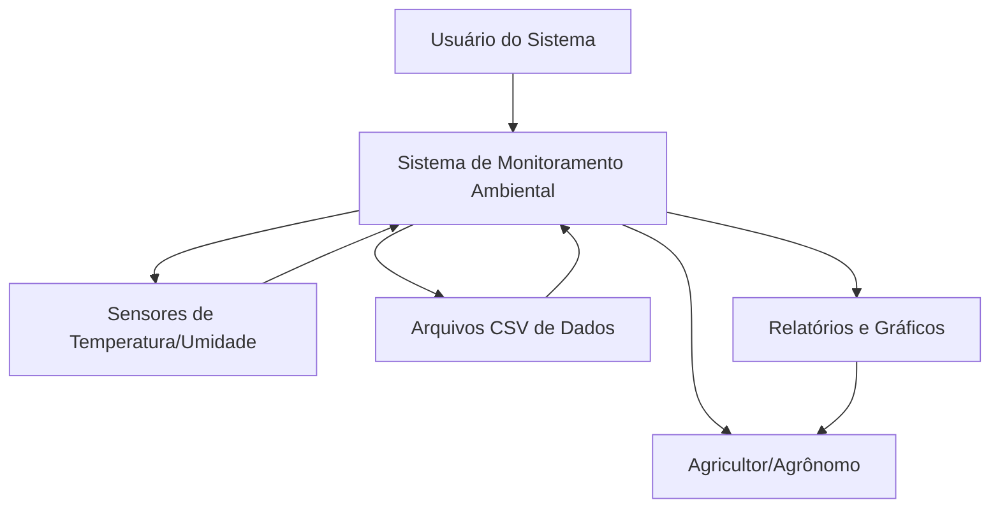

# Sistema de Monitoramento Ambiental para Cultura de Feijão

**Disciplina:** Programação para Ciência de Dados  
**Curso:** MBA Ciência de Dados – UNIFOR  
**Instrutor:** Cássio Pinheiro  
**Integrante:** Leonardo Mesquita Pinto (2528979)

**Repositório Github:** https://github.com/leopinto718/monitoramento_temperatura_umidade/tree/main


---

## 1. Objetivo do Projeto

Este projeto tem como objetivo desenvolver um sistema de monitoramento ambiental para a cultura de feijão, permitindo o acompanhamento contínuo de temperatura e umidade através de dados registrados por sensores.

**Problema resolvido:** Condições ambientais inadequadas podem comprometer o desenvolvimento da cultura do feijão, resultando em perdas de produtividade. Assim, quando detectadas essas condições, o produtor deve adaptar a forma de manejo para evitar prejuízos.

**Público-alvo:** Produtores rurais, agrônomos e técnicos agrícolas envolvidos no cultivo de feijão.

---

## 2. Diagrama de Contexto (Mermaid)



---

## 3. Funcionalidades Implementadas

### Módulo 1 - Fundamentos de Python
- ✅ Cadastro de sensores com validação de dados
- ✅ Registro manual de leituras com tratamento de erros
- ✅ Estruturas de dados (listas, dicionários) para armazenamento
- ✅ Funções bem documentadas com docstrings
- ✅ Manipulação de arquivos JSON para relatórios

### Módulo 2 - Pandas e NumPy
- ✅ Carregamento e limpeza de dados CSV
- ✅ Operações estatísticas sobre DataFrames
- ✅ Agregações por sensor e por hora
- ✅ Identificação de valores extremos
- ✅ Filtragem e seleção de dados

### Módulo 3 - Visualização de Dados
- ✅ Histogramas de temperatura e umidade
- ✅ Gráficos de linha para tendências temporais
- ✅ Gráficos de barras para alertas por sensor
- ✅ Customização de títulos e labels
- ✅ Salvamento automático de visualizações

---

## 4. Estrutura de Dados

### Entrada de Dados
```python
# Estrutura de leitura individual
{
    "sensor_id": "SENSOR_001",
    "temperatura": 25.5,
    "umidade": 65.2,
    "data": "2024-11-07",
    "hora": "14:30",
    "localizacao": "Caucaia"
}
```

### Saída - Relatório de Sensor
```json
{
    "estatisticas": {
        "sensor_id": "sensor_001",
        "temperatura_media": 24.8,
        "temperatura_minima": 18.2,
        "temperatura_maxima": 31.5,
        "umidade_media": 62.3,
        "total_leituras": 150,
        "total_alertas": 12
    },
    "alertas": [...],
    "leituras": [...]
}
```

### Formatos Suportados
- CSV (entrada principal)
- JSON (relatórios de saída)
- PNG (gráficos e visualizações)

---

## 5. Requisitos Técnicos

### Versões
- Python 3.8+
- Pandas 1.3+
- Matplotlib 3.4+
- NumPy 1.20+

### Dependências
```txt
pandas>=1.3.0
matplotlib>=3.4.0
numpy>=1.20.0
```

### Instalação
```bash
pip install -r requirements.txt
```

---

## 6. Como Executar o Projeto

### Instalação
```bash
git clone [https://github.com/leopinto718/monitoramento_temperatura_umidade.git]
cd monitoramento_temperatura_umidade
pip install -r requirements.txt
```

### Execução
```bash
python main.py
```

### Exemplo de Uso
1. Execute o programa: `python main.py`
2. Carregue dados CSV ou insira leituras manualmente
3. Gere relatórios por sensor ou geral
4. Visualize gráficos na pasta `relatorios/`

### Comandos do Menu
```
1 - Carregar leituras de CSV
2 - Inserir leitura manual
3 - Gerar relatório de sensor
4 - Gerar relatório geral
5 - Configurar limites
6 - Sair
```

---

## 7. Análises Realizadas

### Estatísticas Calculadas
- Média, mínimo e máximo de temperatura/umidade
- Total de leituras por sensor
- Quantidade de alertas detectados
- Médias horárias de temperatura

### Insights Principais
- Identificação de horários críticos com temperaturas extremas
- Detecção de sensores e localizações com maior incidência de alertas
- Distribuição das condições ambientais na plantação

### Visualizações Geradas
- **Histogramas**: Distribuição de temperatura e umidade
- **Gráficos de linha**: Tendência temporal por hora
- **Gráficos de barras**: Alertas por sensor
- **Relatórios JSON**: Dados estruturados para análise

---

## 8. Estrutura do Projeto

```
monitoramento_ambiental/
├── README.md
├── requirements.txt
├── sistema_monitoramento.py
├── dados/
│   ├── dados_feijao_ceara.csv
└── relatorios/
    ├── sensor_001/
    │   ├── temperatura_hist.png
    │   ├── umidade_hist.png
    │   └── temperatura_por_hora.png
    ├── geral/
    │   ├── hist_temp_geral.png
    │   ├── hist_umidade_geral.png
    │   └── alertas_por_sensor.png
    ├── rel_sensor_001.json
    └── rel_geral.json
```

---

## 9. Capturas de Tela / Exemplos de Saída

### Exemplo de Saída do Programa
```
=== RELATÓRIO GERAL ===
Total sensores: 10
Total leituras: 600
Total alertas: 468

Relatório salvo automaticamente em:
C:\mba_ciencia_de_dados\...\relatorios\rel_geral.json
```

### Visualizações Geradas
- Histograma de temperatura por sensor
- Gráfico de média de temperatura por hora
- Histograma de umidade por sensor
- Gráfico de alertas por sensor
- Histograma de temperatura geral
- Histograma de umidade geral

---

## 10. Testes Realizados

### Cenários Testados
1. **Carregamento CSV**: Dados válidos, dados com missing values, formato incorreto
2. **Inserção manual**: Valores numéricos válidos, valores inválidos, tipos incorretos
3. **Geração de relatórios**: Sensor existente, sensor não cadastrado, dados insuficientes
4. **Configuração de limites**: Valores válidos, valores inválidos, limites conflitantes

### Validações Implementadas
- Verificação de existência de sensor
- Validação de tipos de dados numéricos
- Tratamento de arquivos não encontrados


---

## 11. Referências e Bibliografia

### Documentação
- [Pandas Documentation](https://pandas.pydata.org/docs/)
- [Matplotlib Documentation](https://matplotlib.org/stable/contents.html)
- [Python Official Documentation](https://docs.python.org/3/)


### Datasets
- Dados simulados de temperatura e umidade do ar para municípios do Ceará
- Limites baseados em literatura agronômica para feijão (https://www.embrapa.br/agencia-de-informacao-tecnologica/cultivos/feijao/pre-producao/clima)

---


## 13. Próximos Passos / Melhorias Futuras

### Expansões
- [ ] Suporte a mais culturas além do feijão
- [ ] Integração com APIs de dados metereológicos
- [ ] App Streamlit para facilitar utilização pelo usuário
- [ ] Análises da relação entre produtividade da cultura e dados metereológicos

---

## 14. Contato

**Dúvidas:** Leonardo Mesquita Pinto  
**E-mail:** leopinto.ca@gmail.com  
**Disciplina:** Programação para Ciência de Dados - MBA Ciência de Dados

---

*Este projeto foi desenvolvido como trabalho final da disciplina de Programação para Ciência de Dados do MBA em Ciência de Dados da Universidade de Fortaleza.*
